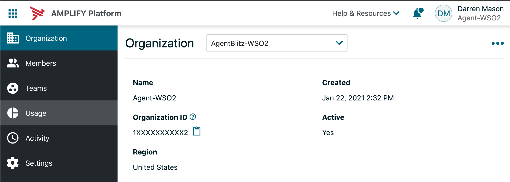
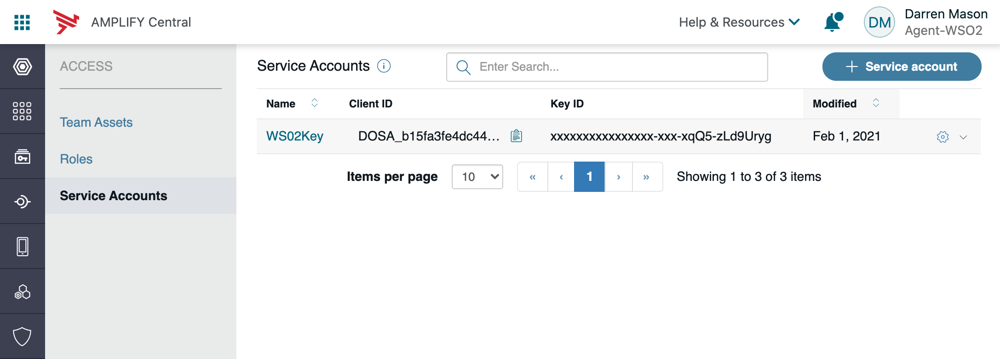
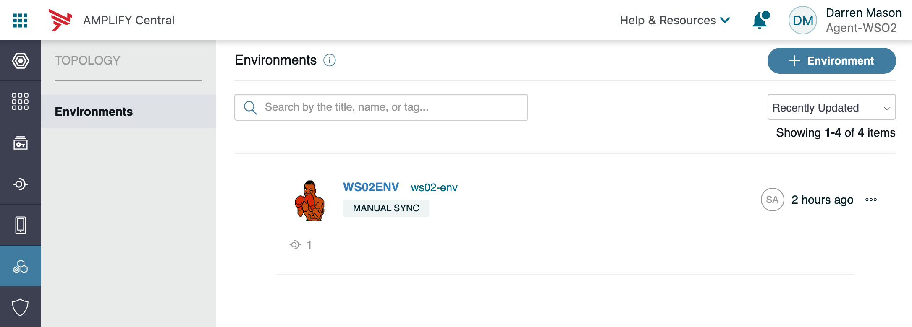

# Discovery Agent
The Discovery Agent is used to discover new published APIs. The Discovery Agent pushes both REST and SOAP API definitions to Amplify Central.

If the Discovery Agent discovers an API where the inbound security is not set to PassThrough / API Key / OAuth, the correlating catalog asset will not be created. Discovered APIs that do not have the correct inbound security will only be available in the environment.

The related APIs are published to Amplify Central either as an API Service in environment or an API Service in environment and optionally as Catalog item (default behavior).


# Prerequisite
1. Golang 
2. Make
3. API Central Account
4. API Platform Organization


# Setting Up Amplify Central Access

## Find Organizion ID


## Create Service Account


Click the `+Service Account` Button

Add a name and public key

Create a Service Account in Central so that the Agents can connect to the Gateway without exposing client credentials

To generate a public key, you can install OpenSSL and run the commands below:
`openssl genpkey -algorithm RSA -out private_key.pem -pkeyopt rsa_keygen_bits:2048
openssl rsa -pubout -in private_key.pem -out public_key.pem`

Note the clientID for later

## Create Environment


Under the Topology tab click the `+Environment` button then fill out the form. Take note of the ID (Logical Name) that is created.


# Docker

## Install
Install WS02 Docker container

`docker run -it -p 8280:8280 -p 8243:8243 -p 9443:9443 --name api-manager wso2/wso2am:3.2.0`

## Running Contianer
` https://localhost:9443/publisher `


# Publish API
Create a basic Pizza API
`https://apim.docs.wso2.com/en/latest/learn/design-api/create-api/create-a-rest-api/`

# Setup WS02 Auth
https://apim.docs.wso2.com/en/latest/develop/product-apis/publisher-apis/publisher-v1/publisher-v1/

Setting up Postman can make this easier. Following Postman collection provides quickstart guide for WSO2 API Manager REST APIs
https://apim.docs.wso2.com/en/latest/develop/product-apis/overview/

```

After you run the Register DCR App you should get something like below. You then will use the ClientId and clientSecret to populate the YML file.
{
"clientId": "fOCi4vNJ59PpHucC2CAYfYuADdMa",
"clientName": "rest_api_publisher",
"callBackURL": "www.google.lk",
"clientSecret": "a4FwHlq0iCIKVs2MPIIDnepZnYMa",
"isSaasApplication": true,
"appOwner": "admin",
"jsonString": "{\"grant_types\":\"client_credentials password refresh_token\",\"redirect_uris\":\"www.google.lk\",\"client_name\":\"rest_api123\"}",
"jsonAppAttribute": "{}",
"tokenType": null
}
```

# Setup YML file
Duplicate the sample apic discovery agent. Then change the organizationID, environment, clietID, username, password, clientID, clientSecret, basepath, tokenEndpoint, private and public key path. 

```
  organizationID: [Located in Amplify Central Organization ]
  environment: [Located in Amplify Central topographical]
  auth:
    clientID: [Located in the Amplify Central Access/Service Accounts]
    privateKey: [Private Key path you used to create the Access/Service Accounts]
    publicKey: [Public Key path you used to create the Access/Service Accounts]
wso2:
//for docker localhost
  basepath: https://localhost:9443/api/am/publisher/v1
  tokenEndpoint: https://localhost:8243/token
  username: [Default WS02 admin]
  password: [Default WS02 admin]
  clientId: [Generated clientID]
  clientSecret: [Generated secret]

  tag: [Optional API Limitor default *]
```

# Tag
If you want to limit the API's that you bring into Amplify Central you can do so with the use of a tag. In the YML file you will see a node called `tag`. When you add a tag here it will limit discovery of to only those API's that use that tag. (optional) default would be *

# Make Build
from the discovery folder run the build
`make build`

## Run the agent
from the root discovery folder run:
` ./bin/apic_discovery_agent`
This will allow your apis to be seen in API Central


# Trouble shooting
CORS errors when calling domains cross domain in browser from central.

Reference: [SDK Documentation - Building Discovery Agent](https://github.com/Axway/agent-sdk/blob/main/docs/discovery/index.md)