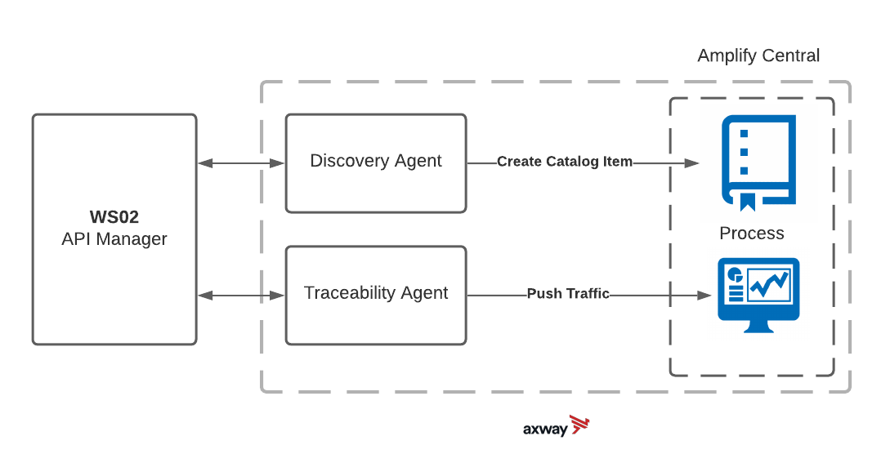

# Traceability Agent
The Traceability Agent sends log information about APIs that have been discovered and published to Amplify Central.



# Prerequisite
1. Golang 
2. Make
3. API Central Account
4. API Platform Organization


# Setting Up Amplify Central Access

## Find Organizion ID


## Create Service Account


Click the `+Service Account` Button

Add a name and public key

Create a Service Account in Central so that the Agents can connect to the Gateway without exposing client credentials

To generate a public key, you can install OpenSSL and run the commands below:
`openssl genpkey -algorithm RSA -out private_key.pem -pkeyopt rsa_keygen_bits:2048
openssl rsa -pubout -in private_key.pem -out public_key.pem`

Note the clientID for later

## Create Environment


Under the Topology tab click the `+Environment` button then fill out the form. Take note of the ID (Logical Name) that is created.


# Docker

## Install
Install WS02 Docker container

`docker run -it -p 8280:8280 -p 8243:8243 -p 9443:9443 --name api-manager wso2/wso2am:3.2.0`

## Running Contianer
` https://localhost:9443/publisher `


# Publish API
Create a basic Pizza API
`https://apim.docs.wso2.com/en/latest/learn/design-api/create-api/create-a-rest-api/`

# Setup WS02 Auth
https://apim.docs.wso2.com/en/latest/develop/product-apis/publisher-apis/publisher-v1/publisher-v1/

Setting up Postman can make this easier. Following Postman collection provides quickstart guide for WSO2 API Manager REST APIs
https://apim.docs.wso2.com/en/latest/develop/product-apis/overview/

```

After you run the Register DCR App you should get something like below. You then will use the ClientId and clientSecret to populate the YML file.
{
"clientId": "fOCi4vNJ59PpHucC2CAYfYuADdMa",
"clientName": "rest_api_publisher",
"callBackURL": "www.google.lk",
"clientSecret": "a4FwHlq0iCIKVs2MPIIDnepZnYMa",
"isSaasApplication": true,
"appOwner": "admin",
"jsonString": "{\"grant_types\":\"client_credentials password refresh_token\",\"redirect_uris\":\"www.google.lk\",\"client_name\":\"rest_api123\"}",
"jsonAppAttribute": "{}",
"tokenType": null
}
```


Reference: [SDK Documentation - Building Traceability Agent](https://github.com/Axway/agent-sdk/blob/main/docs/traceability/index.md)